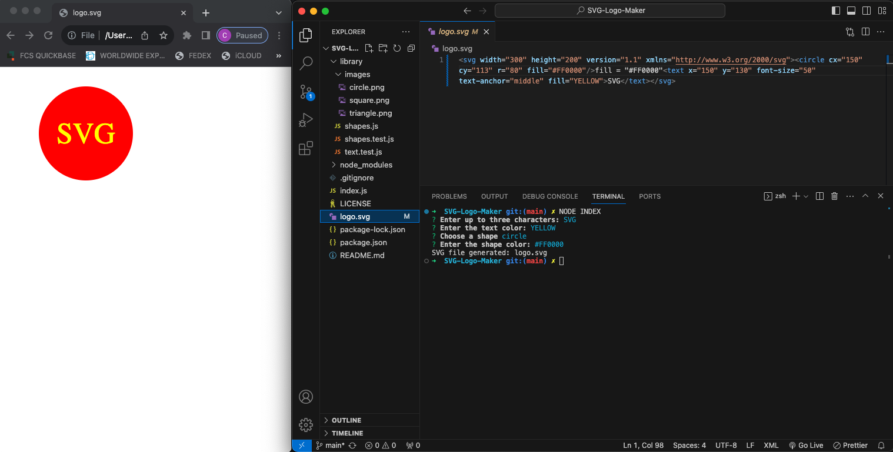

# SVG-LOGO-MAKER



  [](https://opensource.org/licenses/MIT)

  ## Description
  Simple way to produce a logo using up to three characters with your choice of colored text and fill in a circle, triangle, or square. 

  ## Table of Contents
  - [Installation](#installation)
  - [Usage](#usage)
  - [Credits](#credits)
  - [License](#license)
  - [Features](#features)
  - [Contributing](#contibuting)
  - [Tests](#tests)
  - [Questions](#questions)

  ## Installation 
   - ```npm install inquirer@8.2.4```
   - ```npm install --save-dev jest```

  ## Usage
 To use the application, run the following command:
  ```node index.js```  
  You will then be prompted to answer questions in order to produce your SVG logo.  Click video below for demo of how the generator works.
  
 [](https://youtu.be/mz9CE4IC_Uk<VIDEO_ID>)


  ## Credits
  - David Gray (GitHub grayd500)
  - Xpert Learning Assistant
  - Bootcamp class

  ## License
  [](https://opensource.org/licenses/MIT)

  ## Features


  ## Contributing
  

  ## Tests
  Run ```npx test```  on the command line to test function of shapes and colors.

  ## Questions
  If you have questions, you can contact me at [cimarron13@mac.com](mailto:cimarron13@mac.com) or <a href="https://github.com/cjenschke">GitHub</a>.